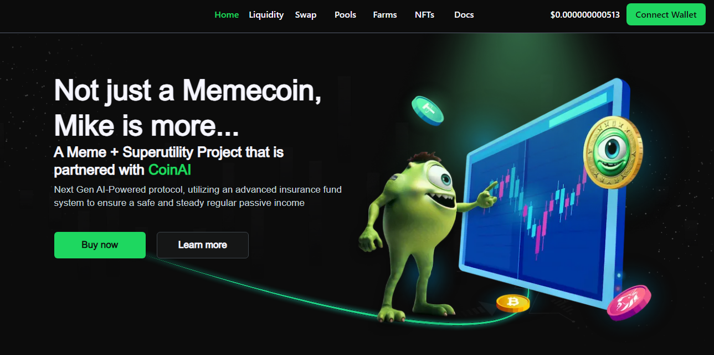

**What is Mike DEX?**

First of all, we need to clarify the differences between the various areas of “Mike DEX”. Some of them may be confusing to new users.

- **Mike DEX Protocol**: A collection of persistent, non-upgradable smart contracts that together create automated market makers, a protocol that facilitates peer-to-peer market making and ERC-20, BEP-20 token exchanges. , a bridge between EVM and SVM.
- **Mike DEX Interface**: A web interface for easy interaction with the Uniswap protocol. Interfaces are just one of many ways to interact with the Uniswap protocol.
- **Mike DEX Governance**: A governance system to manage the Mike protocol activated through UTX tokens.



**Mike Exchange:**

Mike DEX is a decentralized trading and exchange platform designed to provide a transparent, trustless and completely on-chain trading platform.
Mike DEX has an on-chain order book matching engine at its core, helping traders maintain full control of their orders while reducing trading costs and maintaining the same trading experience on centralized exchanges.
V1 is built for the EVM blockchain and is completely permissionless. Partners can use Position Exchange's on-chain central order book to share liquidity and power unique features for a better user experience.

V2 supports:

- Swap
EVM tokens (ERC-20, BEP-20) are supported on the Mike DEX interface swap.
- leg

 Mike Bridge is a software protocol that **facilitates the movement of assets and data between different blockchain networks**, enabling interoperability within the decentralized finance ecosystem. EVM tokens (Ethereum, BSC, Polygon, Arbitrum, Optimism) UTX governance tokens, Internet computers can be used.

**How ​​do you run the project?**

Use version 18.19.0 (the latest version is not bad either).

```bash
  npm install
```

Start the server

```bash
  npm run dev
```